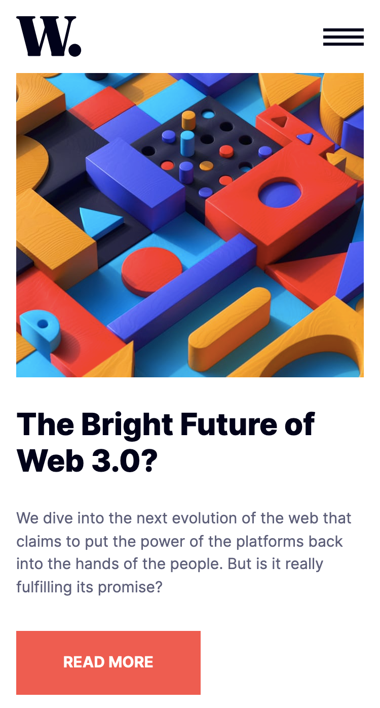
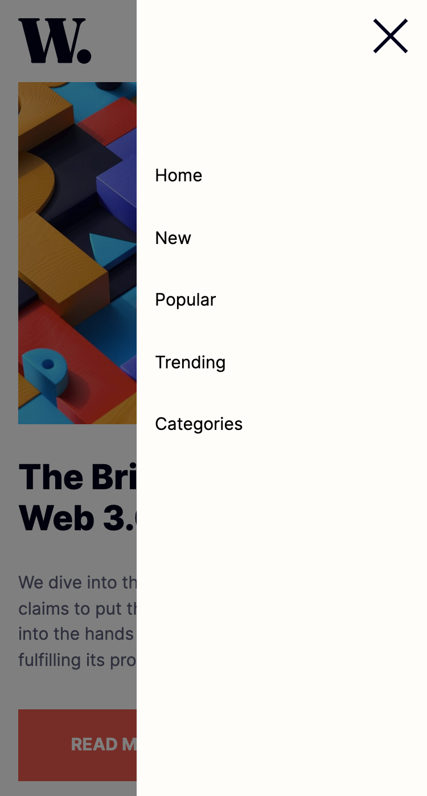
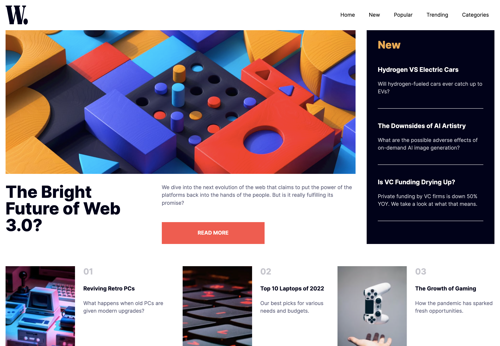
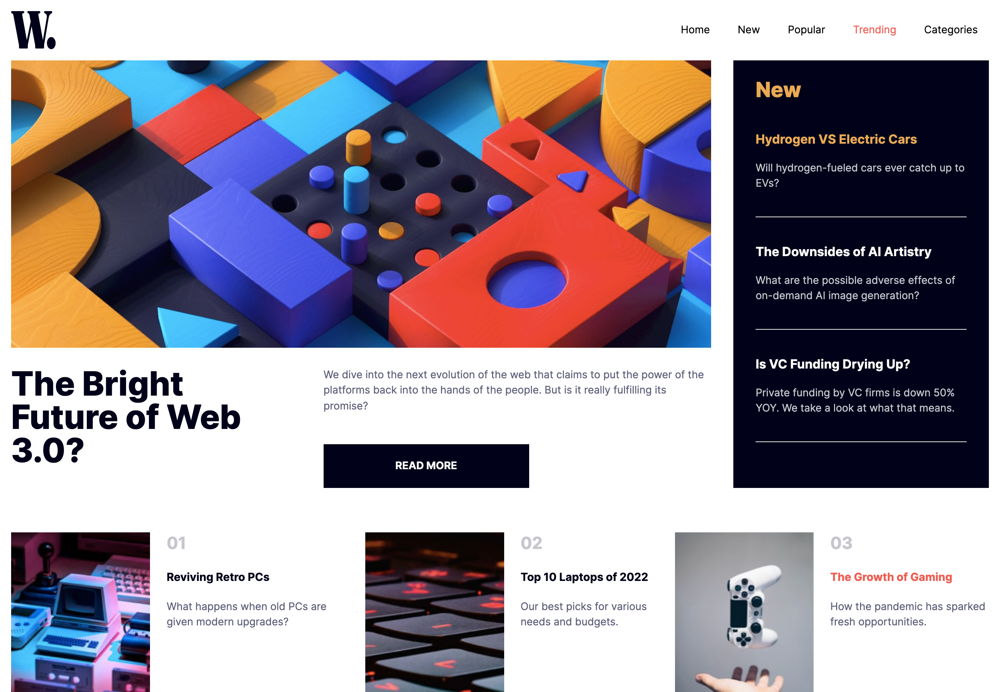

# Solucíon Frontend Mentor - News Homepage

## Tabla de contenidos

- [Solucíon Frontend Mentor - News Homepage](#solucíon-frontend-mentor---news-homepage)
  - [Tabla de contenidos](#tabla-de-contenidos)
  - [Resumen](#resumen)
    - [El Desafío](#el-desafío)
    - [Screenshots](#screenshots)
      - [Mobile](#mobile)
      - [Mobile - Navbar](#mobile---navbar)
      - [Desktop](#desktop)
        - [Hovers](#hovers)
    - [Tenologías](#tenologías)

## Resumen

### El Desafío

Los usuarios deberían poder:

- Ver el diseño óptimo para la interfaz según el tamaño de pantalla de su dispositivo
- Ver estados de desplazamiento y enfoque para todos los elementos interactivos en la página

### Screenshots

#### Mobile

#### Mobile - Navbar

#### Desktop

##### Hovers

### Tenologías

- HTML Semantico
- Flexbox
- Enfoque Mobile First
- Tailwindcss
- Postcss
